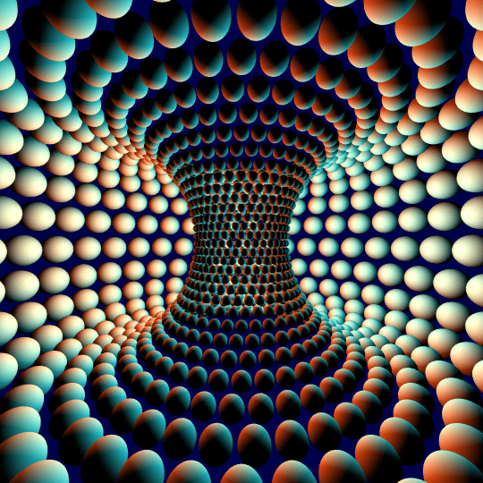

# clifford-torus

A PyTorch implementation of distributions on the Clifford torus `(S^1)^d`, as used by
Clifford-VAE [1] to learn Holographic Reduced Representation (HRR) / Vector Symbolic
Algebra-compatible latent spaces.

This distribution samples points on the  Clifford torus 
`(S^1)^d ⊂ R^(2d)`. This
package also includes the `PowerSpherical` and `HypersphericalUniform` distributions
(adapted from [nicola-decao/power_spherical](https://github.com/nicola-decao/power_spherical) [2]), since the Clifford torus's per-circle concentration can be parameterized with either a
von Mises or a Power Spherical distribution.

## Dependencies

- python >= 3.9
- torch >= 1.10

## Installation

```bash
pip install clifford-torus
```

or from source:

```bash
git clone https://github.com/momalekabid/clifford-torus
cd clifford-torus
pip install .
```

## Structure

- `clifford_torus/distributions.py`: `PowerSpherical`, `HypersphericalUniform`,
  `CliffordTorusUniform`, `CliffordTorusDistribution` (von Mises concentration),
  `CliffordPowerSphericalDistribution` (Power Spherical concentration).

## Usage

Differentiable sampling on a `d`-dimensional Clifford torus, returned as a real vector
of length `2d` whose non-DC Fourier coefficients all have unit magnitude:

```python
import torch
from clifford_torus import CliffordPowerSphericalDistribution, CliffordTorusUniform

d = 8
loc = torch.zeros(d, requires_grad=True)          # per-circle mean angle
concentration = torch.full((d,), 4.0, requires_grad=True)

q = CliffordPowerSphericalDistribution(loc, concentration)
z = q.rsample()               # shape (2*d,), unit-magnitude fourier coefficients
z.sum().backward()
```

KL divergence against the uniform prior on the torus:

```python
p = CliffordTorusUniform(dim=d)
torch.distributions.kl_divergence(q, p)
```

`z` from a `CliffordPowerSphericalDistribution`/`CliffordTorusDistribution` is directly
usable in an HRR/VSA: bind two codes with circular convolution
(`torch.fft.ifft(torch.fft.fft(a) * torch.fft.fft(b)).real`), and unbind with the exact
inverse since every Fourier coefficient has unit magnitude.

## references 


```bibtex
@article{abid2026clifford,
  title={Learning Holographic Reduced Representations with Clifford Variational Autoencoders},
  author={Abid, Mohamed Malek and Furlong, P. Michael},
  year={2026}
}
```

for the underlying `PowerSpherical` distribution we use:

```bibtex
@article{decao2020power,
  title={The Power Spherical distribution},
  author={De Cao, Nicola and Aziz, Wilker},
  journal={Proceedings of the 37th International Conference on Machine Learning, INNF+},
  year={2020}
}
```
Optional memory optimizations can be implemented 
[following this post.](https://evgeniia.tokarch.uk/blog/memory-optimization-for-kl-loss-calculation-in-pytorch/)

## Visualization



Stereographic projection of spheres centered at points on the Clifford torus inside the
3-sphere, rotated in the `zw`-plane and projected down to `R^3`. From Clayton Shonkwiler's
Wolfram Community post, ["[GIF] Inside (Stereographic projection of points on the Clifford
torus)"](https://community.wolfram.com/groups/-/m/t/1245707).

```bibtex
@misc{shonkwiler2017inside,
  title={[GIF] Inside (Stereographic projection of points on the Clifford torus)},
  author={Shonkwiler, Clayton},
  howpublished={Wolfram Community},
  year={2017},
  url={https://community.wolfram.com/groups/-/m/t/1245707}
}
```

## License

MIT
